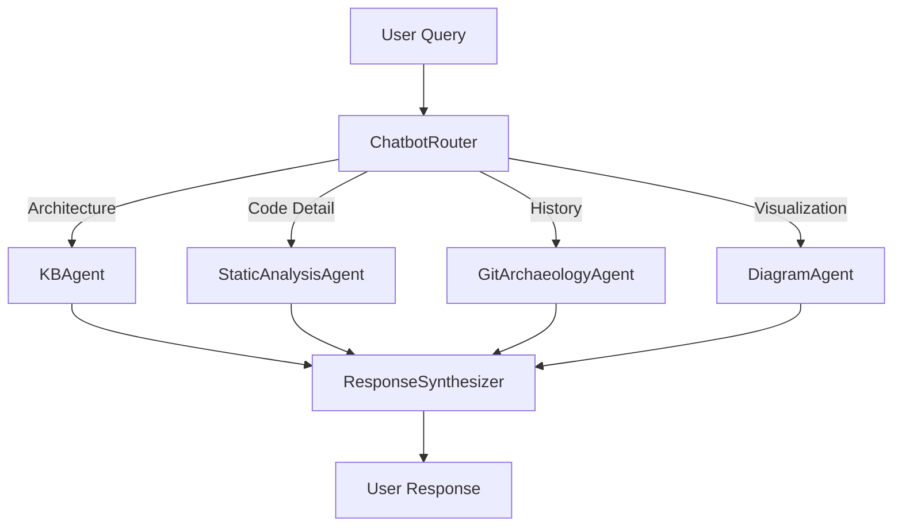

# CodebaseGPT: Agentic Codebase Analysis System

> "Talk to your codebase. Ask it questions. Get answers from a team of expert agents who know its complete history."

## Project Vision

An AI-powered conversational interface that transforms static code repositories into interactive knowledge bases. Users converse with specialized agents that understand code structure, patterns, and evolution history.

---

## Architecture Overview

```
┌─────────────────┐     ┌──────────────────┐     ┌─────────────────┐
│   Chat UI       │────▶│  LangGraph       │────▶│  Knowledge      │
│   (Frontend)    │◀────│  Orchestrator    │◀────│  Layer          │
└─────────────────┘     └──────────────────┘     └─────────────────┘
                              │                         │
                        ┌─────┴─────┐            ┌─────┴─────┐
                        │  Agents   │            │  Storage  │
                        │  (Nodes)  │            │  Systems  │
                        └───────────┘            └───────────┘
```

### Core Components

1. **Preprocessing Pipeline** - One-time full repository analysis
2. **Knowledge Layer** - Persistent storage (Vector DB + Graph DB)
3. **Agent Orchestrator** - LangGraph state machine
4. **Specialized Agents** - Domain-expert LLM nodes with tools
5. **Chat Interface** - Natural language interaction layer

---

## Agent Architecture

### Agent Graph Flow



### State Schema

```python
from typing import TypedDict, List, Optional, Annotated
from operator import add

class AgentState(TypedDict):
    # Immutable context
    repo_id: str
    repo_path: str
    
    # Conversation
    user_query: str
    chat_history: List[dict]
    
    # Working memory
    current_focus: Optional[str]  # file path or function name
    findings: Annotated[List[dict], add]  # accumulated by agents
    
    # Control flow
    next_agent: Optional[str]
    iteration_count: int
    
    # Output
    response: Optional[str]
    artifacts: List[dict]  # diagrams, code snippets, etc.
```

---

## Agent Specifications

### 1. ChatbotRouter (Entry Point)

**Responsibility:** Query classification and routing

**Tools:** None (pure reasoning)

**Routing Logic:**
- Keywords: "diagram", "visualize", "show" → DiagramAgent
- Keywords: "why", "when", "history", "changed" → GitArchaeologyAgent
- Keywords: "how", "explain", "this function/file" → StaticAnalysisAgent
- Keywords: "architecture", "overview", "dependencies" → KBAgent
- Ambiguous → Request clarification OR multi-agent sequence

**Prompt Template:**
```
You are a routing agent for a codebase analysis system.
Analyze the user query and determine which specialist agent(s) should handle it.

Available agents:
- KBAgent: High-level architecture, dependencies, design patterns
- StaticAnalysisAgent: Specific code explanation, complexity analysis
- GitArchaeologyAgent: Change history, evolution, "why" questions
- DiagramAgent: Visual representations, graphs, charts

User Query: {query}
Chat History: {history}
Current Focus: {focus}

Respond with JSON:
{
  "primary_agent": "agent_name",
  "secondary_agents": [],
  "reasoning": "brief explanation"
}
```

### 2. KBAgent (The Architect)

**Responsibility:** Big-picture architectural understanding

**Tools:**
- `vector_search(query: str, top_k: int)` - Semantic code search
- `graph_query(cypher: str)` - Neo4j relationship queries
- `get_module_summary(module_path: str)` - Pre-computed module summaries

**Query Patterns:**
```cypher
// Find all services calling a model
MATCH (s:Service)-[:IMPORTS]->(m:Model {name: $model_name})
RETURN s.name, s.file_path

// Identify circular dependencies
MATCH path = (a:Module)-[:DEPENDS_ON*]->(a)
RETURN path
```

### 3. StaticAnalysisAgent (Code Reviewer)

**Responsibility:** Deep code inspection on specific targets

**Tools:**
- `parse_file_ast(file_path: str)` - Tree-sitter parsing
- `detect_patterns(ast_json: dict)` - Pattern/anti-pattern detection
- `calculate_complexity(function_name: str, file_path: str)` - Cyclomatic complexity
- `get_type_hints(symbol: str)` - Type information extraction

**Output Format:**
```json
{
  "file": "src/services/user_service.py",
  "function": "calculate_total",
  "complexity_score": 15,
  "patterns_detected": ["Strategy Pattern", "Null Object Pattern"],
  "anti_patterns": ["God Method (>50 lines)"],
  "explanation": "This function orchestrates payment calculation..."
}
```

### 4. GitArchaeologyAgent (Historian)

**Responsibility:** Code evolution and change narratives

**Tools:**
- `git_blame(file_path: str, line_range: tuple)` - Last modification info
- `git_log_function(function_name: str, file_path: str)` - Function history
- `git_diff_summary(commit_hash: str)` - What changed in commit
- `summarize_commits(commit_messages: List[str])` - LLM-powered summarization

**Narrative Generation:**
```
Timeline for `UserService.authenticate()`:
1. [2023-01-15] Initial implementation - basic password check
2. [2023-03-22] Added rate limiting after security audit
3. [2023-06-10] Refactored to support OAuth providers
4. [2023-11-01] Performance optimization - added caching
```

### 5. DiagramAgent (Visualizer)

**Responsibility:** On-demand visual representations

**Tools:**
- `graph_to_mermaid(query_result: dict, diagram_type: str)` - Convert data to Mermaid
- `generate_c4_diagram(scope: str)` - C4 model diagrams
- `create_sequence_diagram(function_call_chain: List)` - Interaction flows
- `render_diagram(mermaid_code: str)` - Generate image

**Supported Diagrams:**
- C4 Context/Container/Component
- UML Class diagrams
- Sequence diagrams
- Dependency graphs
- Module interaction maps

### 6. ResponseSynthesizerAgent (Spokesperson)

**Responsibility:** Final answer composition

**Input:** All findings from previous agents

**Output:** Coherent natural language response with embedded artifacts

**Synthesis Rules:**
- Lead with direct answer to user's question
- Support with evidence from findings
- Embed relevant diagrams/code snippets
- Suggest follow-up questions
- Maintain conversational tone

---

## Tool Implementations

### Core Tool Interface

```python
from abc import ABC, abstractmethod
from typing import Any, Dict

class BaseTool(ABC):
    name: str
    description: str
    
    @abstractmethod
    def execute(self, **kwargs) -> Dict[str, Any]:
        """Execute tool and return structured result"""
        pass
    
    @property
    def schema(self) -> dict:
        """OpenAI function calling schema"""
        pass
```

### Tree-sitter Parser Tool

```python
class ASTParserTool(BaseTool):
    name = "parse_file_ast"
    description = "Parse source file into AST representation"
    
    supported_languages = {
        ".py": "python",
        ".js": "javascript",
        ".ts": "typescript",
        ".java": "java",
        ".go": "go",
        ".rs": "rust"
    }
    
    def execute(self, file_path: str) -> Dict[str, Any]:
        # Returns structured AST, not raw file content
        # This keeps context window manageable
        pass
```

### Git History Tool

```python
class GitLogTool(BaseTool):
    name = "git_log_function"
    description = "Get commit history for specific function"
    
    def execute(self, function_name: str, file_path: str) -> Dict[str, Any]:
        # Uses git log -L :<function_name>:<file_path>
        # Returns structured commit data
        pass
```

---

## Knowledge Layer

### Vector Database Schema (ChromaDB/Qdrant)

**Collections:**
1. `code_chunks` - Function/class level embeddings
2. `documentation` - README, docstrings, comments
3. `commit_messages` - Git history semantic search
4. `module_summaries` - Pre-generated architectural summaries

**Metadata:**
```json
{
  "file_path": "src/auth/oauth.py",
  "symbol_name": "OAuthProvider",
  "symbol_type": "class",
  "language": "python",
  "last_modified": "2024-01-15",
  "complexity_score": 12,
  "lines_of_code": 150
}
```

### Knowledge Graph Schema (Neo4j)

**Node Types:**
- `Module` - Directory/package level
- `File` - Source file
- `Class` - Class definition
- `Function` - Function/method
- `Variable` - Global/module level variables

**Relationship Types:**
- `CONTAINS` - Structural hierarchy
- `IMPORTS` - Import dependencies
- `CALLS` - Function invocations
- `INHERITS` - Class inheritance
- `IMPLEMENTS` - Interface implementation
- `USES` - Variable/constant usage

**Example Queries:**
```cypher
// Find most coupled modules
MATCH (m1:Module)-[r:IMPORTS]->(m2:Module)
RETURN m1.name, m2.name, count(r) as coupling
ORDER BY coupling DESC
LIMIT 10

// Identify potential god classes
MATCH (c:Class)-[:CONTAINS]->(f:Function)
WITH c, count(f) as method_count
WHERE method_count > 20
RETURN c.name, c.file_path, method_count
```

---

## Preprocessing Pipeline

### Phase 1: Repository Ingestion

```bash
# Clone repository
git clone <repo_url> /tmp/analysis/<repo_id>

# Detect language composition
linguist /tmp/analysis/<repo_id>

# Generate file manifest
find . -type f -name "*.py" -o -name "*.js" ...
```

### Phase 2: Static Analysis

1. **AST Extraction** - Parse all source files
2. **Symbol Resolution** - Build symbol tables
3. **Dependency Mapping** - Extract import relationships
4. **Complexity Calculation** - Cyclomatic, cognitive complexity
5. **Pattern Detection** - Identify design patterns

### Phase 3: Git Archaeology

1. **Commit History** - Full log with diffs
2. **Blame Information** - Line-by-line attribution
3. **Churn Analysis** - Frequently modified files
4. **Author Statistics** - Contribution patterns

### Phase 4: Knowledge Base Population

1. **Embedding Generation** - Code chunks → vectors
2. **Graph Construction** - Relationships → Neo4j
3. **Summary Generation** - LLM-powered module descriptions
4. **Index Building** - Full-text search indices

---

## Configuration

### Environment Variables

```bash
# Core Infrastructure
OPENAI_API_KEY=sk-...
# OR
ANTHROPIC_API_KEY=sk-ant-...

# Vector Database
VECTOR_DB_TYPE=chromadb  # chromadb | qdrant | pinecone
VECTOR_DB_HOST=localhost
VECTOR_DB_PORT=8000
EMBEDDING_MODEL=text-embedding-3-small

# Graph Database
NEO4J_URI=bolt://localhost:7687
NEO4J_USER=neo4j
NEO4J_PASSWORD=password

# Repository Storage
REPO_STORAGE_PATH=/data/repositories
ANALYSIS_CACHE_PATH=/data/cache

# LLM Configuration
LLM_MODEL=gpt-4-turbo  # or claude-3-opus
LLM_TEMPERATURE=0.1
LLM_MAX_TOKENS=4096

# Agent Configuration
MAX_AGENT_ITERATIONS=10
MAX_TOOLS_PER_TURN=5
CONTEXT_WINDOW_LIMIT=128000
```

### Agent Configuration (YAML)

```yaml
# config/agents.yaml

router:
  model: gpt-4-turbo
  temperature: 0.0
  max_tokens: 500
  
kb_agent:
  model: gpt-4-turbo
  temperature: 0.2
  max_tokens: 2000
  tools:
    - vector_search
    - graph_query
    - get_module_summary
  
static_analysis_agent:
  model: gpt-4-turbo
  temperature: 0.1
  max_tokens: 3000
  tools:
    - parse_file_ast
    - detect_patterns
    - calculate_complexity
    - get_type_hints

git_archaeology_agent:
  model: gpt-4-turbo
  temperature: 0.3
  max_tokens: 2500
  tools:
    - git_blame
    - git_log_function
    - git_diff_summary
    - summarize_commits

diagram_agent:
  model: gpt-4-turbo
  temperature: 0.2
  max_tokens: 2000
  tools:
    - graph_to_mermaid
    - generate_c4_diagram
    - create_sequence_diagram
    - render_diagram

response_synthesizer:
  model: gpt-4-turbo
  temperature: 0.4
  max_tokens: 4000
```

### Pattern Detection Rules

```yaml
# config/patterns.yaml

design_patterns:
  singleton:
    indicators:
      - private_constructor
      - static_instance_method
      - single_instance_field
    
  factory:
    indicators:
      - create_method_naming
      - returns_interface_type
      - conditional_instantiation
  
  strategy:
    indicators:
      - interface_parameter
      - behavior_delegation
      - runtime_selection

anti_patterns:
  god_class:
    thresholds:
      methods: 20
      lines: 500
      dependencies: 15
    
  feature_envy:
    indicators:
      - excessive_external_calls
      - minimal_self_reference
    
  long_method:
    thresholds:
      lines: 50
      parameters: 7
      complexity: 15
```

---

## Safety & Guardrails

### Context Window Management

```python
class ContextManager:
    def __init__(self, max_tokens: int = 128000):
        self.max_tokens = max_tokens
        self.reserved_for_response = 4000
        
    def truncate_findings(self, findings: List[dict]) -> List[dict]:
        """Ensure findings fit within context limits"""
        pass
    
    def summarize_history(self, chat_history: List[dict]) -> List[dict]:
        """Compress old conversation turns"""
        pass
```

### Tool Execution Safety

```python
class ToolExecutor:
    def __init__(self):
        self.allowed_tools = set()
        self.execution_timeout = 30  # seconds
        self.max_file_size = 1_000_000  # 1MB
        
    def validate_tool_call(self, tool_name: str, params: dict) -> bool:
        """Prevent malicious tool usage"""
        pass
    
    def sandbox_execution(self, tool: BaseTool, params: dict):
        """Execute tool in isolated environment"""
        pass
```

### Graph Cycle Prevention

```python
class GraphController:
    def __init__(self):
        self.max_iterations = 10
        self.visited_agents = []
        
    def can_route_to(self, agent: str, state: AgentState) -> bool:
        """Prevent infinite loops in agent graph"""
        if state["iteration_count"] >= self.max_iterations:
            return False
        # Force routing to ResponseSynthesizer
        return True
```

---

## Cost Management

### Token Tracking

```python
class CostTracker:
    pricing = {
        "gpt-4-turbo": {"input": 0.01, "output": 0.03},  # per 1K tokens
        "gpt-3.5-turbo": {"input": 0.0005, "output": 0.0015},
    }
    
    def track_usage(self, model: str, input_tokens: int, output_tokens: int):
        pass
    
    def get_session_cost(self) -> float:
        pass
    
    def enforce_budget(self, max_cost: float) -> bool:
        pass
```

### Query Rate Limiting

```python
class RateLimiter:
    def __init__(self):
        self.queries_per_hour = 100
        self.tokens_per_day = 1_000_000
        
    def allow_query(self, user_id: str) -> bool:
        pass
```

---

## Observability

### Logging Structure

```python
import structlog

logger = structlog.get_logger()

# Agent execution
logger.info(
    "agent_execution",
    agent="GitArchaeologyAgent",
    tools_called=["git_log_function", "summarize_commits"],
    tokens_used=1500,
    duration_ms=2300
)

# Tool performance
logger.info(
    "tool_execution",
    tool="parse_file_ast",
    file_path="src/main.py",
    duration_ms=150,
    success=True
)
```

### Metrics to Track

- Query latency (p50, p95, p99)
- Agent routing accuracy
- Tool success/failure rates
- Token usage per query type
- User satisfaction scores
- Context window utilization

---

## Development Roadmap

### Phase 1: Foundation (Weeks 1-3)
- [ ] Set up infrastructure (Vector DB, Neo4j, Redis)
- [ ] Implement preprocessing pipeline
- [ ] Build core tool interfaces
- [ ] Create basic LangGraph structure

### Phase 2: Agent Implementation (Weeks 4-6)
- [ ] Implement ChatbotRouter with routing logic
- [ ] Build KBAgent with graph/vector queries
- [ ] Develop StaticAnalysisAgent with AST tools
- [ ] Create GitArchaeologyAgent with history tools
- [ ] Implement DiagramAgent with visualization
- [ ] Build ResponseSynthesizerAgent

### Phase 3: Integration (Weeks 7-8)
- [ ] Connect all agents in LangGraph
- [ ] Implement state management
- [ ] Add error handling and fallbacks
- [ ] Build chat interface

### Phase 4: Refinement (Weeks 9-10)
- [ ] Optimize prompts based on testing
- [ ] Tune tool parameters
- [ ] Implement caching strategies
- [ ] Add observability

### Phase 5: Production Hardening (Weeks 11-12)
- [ ] Security audit
- [ ] Load testing
- [ ] Cost optimization
- [ ] Documentation

---

## Testing Strategy

### Unit Tests
- Individual tool correctness
- Agent routing logic
- State transformation functions

### Integration Tests
- Full agent graph traversal
- Database query accuracy
- Tool chaining scenarios

### End-to-End Tests
- Common user query patterns
- Multi-turn conversations
- Edge cases (large files, complex repos)

### Evaluation Metrics
- Response accuracy (human evaluation)
- Routing precision
- Tool selection appropriateness
- Coherence of synthesized responses

---

## Future Enhancements

1. **Code Modification Agent** - Suggest refactoring, auto-fix issues
2. **Test Generation Agent** - Generate unit tests based on code understanding
3. **Documentation Agent** - Auto-generate/update documentation
4. **Security Audit Agent** - Identify vulnerabilities
5. **Performance Agent** - Detect bottlenecks and optimization opportunities
6. **Multi-Repository Support** - Cross-repo dependency analysis
7. **Real-time Collaboration** - Multiple users, shared sessions
8. **IDE Integration** - VS Code/IntelliJ plugins

---

## References

- [LangGraph Documentation](https://langchain-ai.github.io/langgraph/)
- [Tree-sitter](https://tree-sitter.github.io/tree-sitter/)
- [Neo4j Graph Data Science](https://neo4j.com/docs/graph-data-science/)
- [ChromaDB](https://www.trychroma.com/)
- [Anthropic Claude](https://docs.anthropic.com/)
- [OpenAI Function Calling](https://platform.openai.com/docs/guides/function-calling)
